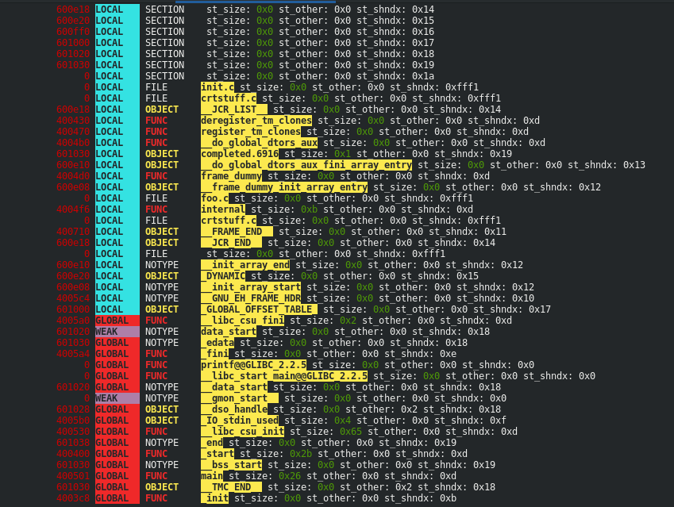
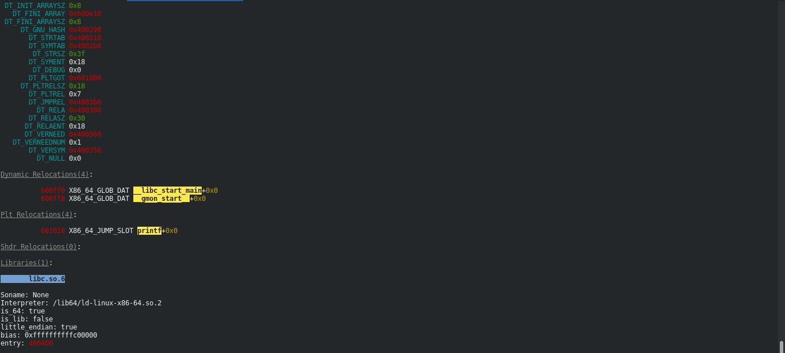

# bingrep

Greps through binaries from various OSs and architectures, and colors them (for ELF only at the moment).





## Build

cargo build --release

## Run

Example:

```
bingrep /bin/ls
```

To dump internal debug representation of the parsed binary:

```
bingrep -d /bin/ls
```
