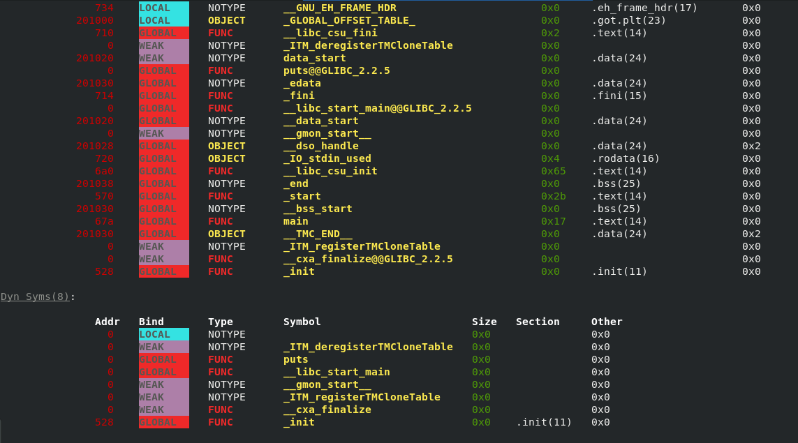
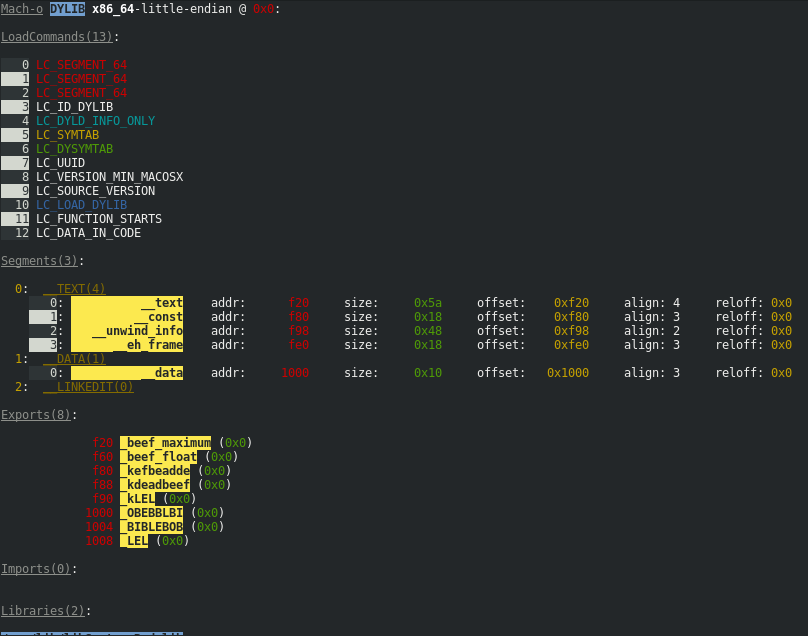

# bingrep [](https://travis-ci.org/m4b/bingrep)

Greps through binaries from various OSs and architectures, and colors them. Current backends:

* ELF 32/64, arm, x86, openrisc - all others will parse and color, but relocations won't show properly
* Mach 32/64, arm, x86
* Unix and BSD archive printer
* PE (debug only)

**NOTE**: Building requires rustc version 1.20 or greater.  If you're using a distro's rust compiler, consider using https://rustup.rs to install your rustc compiler and associated binaries.







## Install

`bingrep` is available through cargo, via `cargo install bingrep`, or you can build, and install the resulting binary wherever you like.

## Build

`cargo build --release`

Now copy the resulting binary in `<path_to_bingrep>/target/release/bingrep` wherever you like.

## Run

Example:

```
bingrep /bin/ls
```

To dump internal debug representation of the parsed binary:

```
bingrep -d /bin/ls
```

To demangle symbols, use `-D` or `--demangle`:

```
bingrep -D /bin/ls
```

## Meta Analysis (Experimental)

You can print a hextable (WIP) via `--hex` or an overview of file offset ranges via `--ranges`.


## Searching

Search functionality is being added.

You can try it out using `bingrep --search "string" ` or `bingrep -s "string"`.  Currently only works for ELF targets.

Please chime in on https://github.com/m4b/bingrep/issues/13 for how this functionality will:

1. Be presented,
2. What API will be exposed
3. What usecases are most important (e.g., how do you like to search binaries)
4. How it will be implemented

# FAQ

> Why is this repo called bingrep, it's nothing like grep at all

That's a good question; I was using this as a personal development tool for some time, and I was conferring with someone from the internet about some binary stuff, when I decided I should just upload this to a proper repo instead of sending pictures. So I quickly created a repo, I felt like I had been greppin' through binaries, so that was the name I uploaded.  Even worse, I named it `bg` as the produced executable at the time of the upload, and this of course immediately conflicted with the unix command `bg`. There's an [issue](https://github.com/m4b/bingrep/issues/1) for a better name, you can chime in too!

> Why do you/should I use this instead of X ?

For some of my projects or workflows I need to very quickly see the load address, offset, or size of a symbol/program header/section header/export/import. I got tired of using objdump/nm/X because really, I just needed to colorize addresses, sizes etc., so I can quickly identify them and move on.  So I wrote this, very quickly, and named it a bad name (sorry!). Then I went totally overboard and started coloring everything, everywhere.  You love it, don't worry. Also you're free to use anything you want, whatever makes you happy and productive!

> Is there anything to work on?

Yes, there are several open issues. I think I'd actually like to port the symbol map functionality (which enables printing every binary that exports a symbol) from https://github.com/m4b/rdr, as well as implement a "reverse symbol map", which finds every binary that calls/imports a symbol.

If you also like hacking on binary stuff, the backend this uses, https://github.com/m4b/goblin, is responsible for the actual loading, parsing, etc., and there are several open issues on that repo as well if you feel like contributing.
